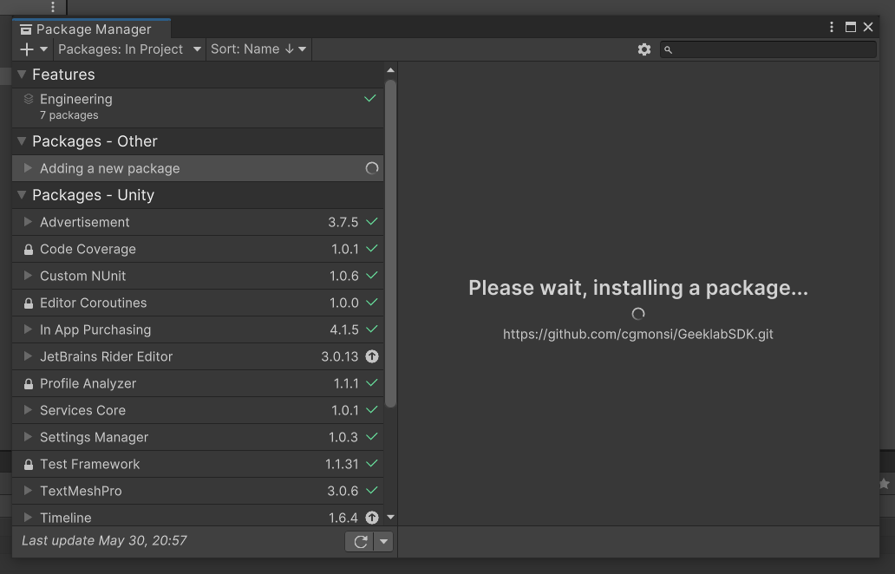

# Geeklab SDK

Geeklab SDK is a set of utilities for development in Unity. It includes tools for handling deep links, collecting metrics, managing network requests, and much more.

---

## Installation Guide
This guide will explain how to install the Geeklab SDK Unity package directly from a GitHub repository using the Unity Package Manager.

### Step 1: Open the Package Manager
Navigate to Window -> Package Manager in Unity's top menu. This will open the Unity Package Manager window.


### Step 2: Add package from Git URL
In the Package Manager window, click on the + button located at the top left corner and select Add package from git URL.


### Step 3: Enter the Repository URL
A dialog box will appear. In this box, enter the URL of the GitHub repository and click on Add.


### Step 4: Import the package
Unity will automatically import the package into your project. It may take a few moments for the package to be downloaded and imported.



### Step 5: Verify the installation
Once the package is imported, you should see it listed in the Unity Package Manager. Verify that the package is listed and that the correct version has been installed.

That's it! You've successfully installed a Unity package from a GitHub repository using the Unity Package Manager.

---

## Directory Structure
```
├── Handlers
│   ├── DeepLinkHandler.cs
│   ├── DeviceInfoHandler.cs
│   ├── ClipboardHandler.cs
│   ├── TokenHandler.cs
├── Metrics
│   ├── EngagementMetrics.cs
│   ├── PurchaseMetrics.cs
│   ├── AdMetrics.cs
├── Managers
│   ├── WebRequestManager.cs
├── Utils
│   ├── MetricToggle.cs
├── Models
│   ├── ApiEndpoints.cs
│   ├── DeviceInfo.cs
│   ├── Metrics.cs
│   ├── TokenResponse.cs
```


## Component Descriptions

### Handlers

- `DeepLinkHandler.cs`: Handles deep linking in Unity. Supports handling URLs passed through deep links and passes them to the appropriate services.

- `DeviceInfoHandler.cs`: Gathers and stores information about the device. Used for device identification and provides important information that can affect app behavior.

- `ClipboardHandler.cs`: Handles the clipboard contents. Allows for reading and writing data to the clipboard.

- `TokenHandler.cs`: Handles authorization tokens. Sends requests to the server for token retrieval, stores retrieved tokens, and checks token lifetimes.

### Metrics

- `EngagementMetrics.cs`: Collects user engagement metrics. Can track parameters such as session time, user activity, UI interaction, etc.

- `PurchaseMetrics.cs`: Collects purchase metrics. Tracks user purchases within the app, including transaction details and currency used.

- `AdMetrics.cs`: Collects advertising metrics. Can track ad displays, and user interaction with advertisements.

### Managers

- `WebRequestManager.cs`: Manages network requests. Supports sending and receiving data, handling server responses, and managing request errors.

### Utils

- `MetricToggle.cs`: A utility script for enabling and disabling metrics collection.

### Models

- `DeviceInfo.cs`: A model for device information. Contains fields for device specifications and operating system information.

- `Metrics.cs`: A model for storing collected metrics. Contains fields for various types of metrics, such as engagement, purchase, and ad metrics.

- `ApiEndpoints.cs`: Manages API endpoints. Contains URL definitions and handles URL construction for API requests.

---


## Usage

The GeeklabSDK provides straightforward access to a range of functionalities, without any need for manual setup. Here's an overview of the main components:


### Initialization

On game startup, GeeklabSDK automatically initializes itself, establishing its presence on the scene. This means you don't have to manually attach any scripts to your game objects.


### Accessing Functionality

All the functionalities provided by GeeklabSDK can be accessed through the central GeeklabSDK.cs class. It functions as the entry point to the various features and services offered by the SDK.


### Metrics

Metrics collection is automated by the SDK. It collects data from various sources, storing them in relevant models. The collection of specific types of metrics can be managed programmatically using the `GeeklabSDK.ToggleMetricsCollection(bool isEnabled)` method.


### Managers

Managers take care of specific operations such as network requests or coroutine management. You don't need to set them up manually; instead, call the relevant methods from `GeeklabSDK.cs`.

Remember, GeeklabSDK handles its own setup, enabling a smooth integration process. This leaves you free to focus on leveraging its capabilities to enhance your game.


### Models

The models in this SDK are static classes designed to store data. They encapsulate various types of data such as device information or metrics, allowing you to easily access and manage this information in a structured manner.

---

## License

The Geeklab SDK is licensed under the MIT license. See the `LICENSE` file for more information.


## Support

If you encounter any issues or have any questions about this SDK, please feel free to reach out to us for support. You can contact the developer directly via email at:

`monsicg@gmail.com`

We appreciate your feedback and we're here to help you get the most out of the Geeklab SDK. Please don't hesitate to get in touch if you need assistance.

---

## Helpful links

- [API1 - https://geeklab.app/posts/api-v1/](https://geeklab.app/posts/api-v1/)

- [API2 - https://help.geeklab.app/en/article/geeklab-api-documentation-gcxquc](https://help.geeklab.app/en/article/geeklab-api-documentation-gcxquc)

- [DOC - https://docs.google.com/document/d/1u2-QWlseR1GwLYRejNVogqzFgQqDeOs0CsaPhkYO06Q/edit#heading=h.3znysh7](https://docs.google.com/document/d/1u2-QWlseR1GwLYRejNVogqzFgQqDeOs0CsaPhkYO06Q/edit#heading=h.3znysh7)